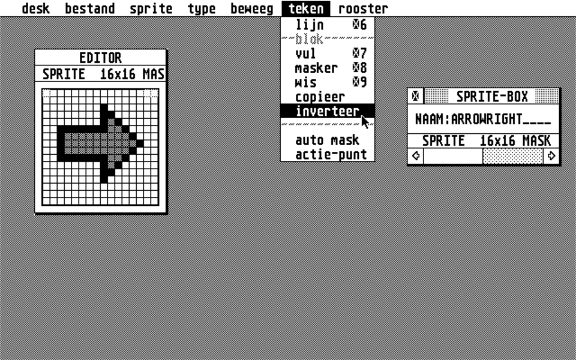

# SPR_EDIT
Sprite editor for the Atari ST written in GFA Basic 3.

In 1987, I bought an Atari ST 520, a big step up from the Atari 800XL I had before.
I wanted to write a game, like I've done on the 800XL, but couldn't find a good
sprite editor.

So I started developing a sprite editor. I kept adding features and spend many evenings
programming. I learned a lot about programming, GUI's and computers in general.

At the end, in 1991, the [program](SPR_EDIT/SPR_EDIT.LST) grew to 1.463 lines of code. It supported masking,
auto masking, drawing lines and geometric figures, copy and pasting bitmaps and
exporting to the ICN format.
It also included a [help file](SPR_EDIT/SPR_EDIT.HLP) which explains all the options.

I planned to make it shareware. It would've been a great addition to the existing
Atari ST icon/sprite editors. GFA Basic 3 provided a compiler, so I was exited to use that
to generate a proper program. Unfortunately, the compiled code didn't work correctly
and I lost interest.

I created a [new release](https://github.com/edwinm/SPR_EDIT/releases/tag/v2.0)
with a compiled executable and hopefully this one works fine.

One other thing: the software is in Dutch. I don't know why I've never translated
it to English, pretty much a requirement to publish software as shareware.
I think I could've translated all menu options, but translating the help file
was a step too far at that time.

I release the software as open source. Go ahead and translate it to English,
compile it, and maybe you will release it as shareware 32+ years later.

## Screenshots

Screenshot with about dialog

Screenshot with icon test

Screenshot with open drawing menu

## Resources

If you want to play with Atari ST software today, you can use the following resources

Hatari is a modern Atari ST emulator.
Go to the [command line options](https://hatari.tuxfamily.org/doc/manual.html#Command_line_options_and_arguments)
to set everything up.

Suggested command line options:
`--monitor mono`
`--harddrive <dir>` (Replace `<dir>` with the path of the directory you want to make available within the emulator).

https://hatari.tuxfamily.org/

If you search the internet, you might be able to find GFA Basic 3 for the Atari ST and TOS 2.06.

April 2023, Edwin Martin